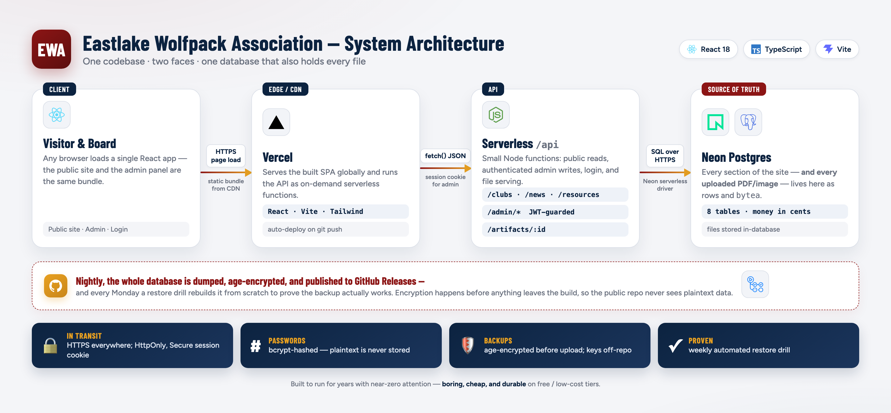

# Eastlake Wolfpack Association

### The booster-club platform for Eastlake High School athletics, arts & sciences

**One site. Two faces. One database the board owns.**

 

 

**[🌐 Live site](https://ewa-website-revamp.vercel.app)** · **[📦 Repository](https://github.com/drewdog88/ewa-website-revamp)** · 501(c)(3) nonprofit · Tax ID 77-0616862

---

> **Why this platform exists.** A volunteer booster board turns over every year.
> The old site needed a developer and a deploy for every announcement, handbook,
> or club. This rebuild hands the board a site they run themselves — every word
> and file editable in an admin panel, backed by one database that backs up and
> proves its own recovery, safe to keep in a public repo.

Welcome to the engineering wiki. It explains *what the site is, what problem it
solves, and how it works* — in enough detail that a board member can run it and a
developer can extend it.

## What it delivers

| | Capability | How |
|---|---|---|
| 🖥️ | **A public site** | Clubs directory, news, resources, fundraiser tracker, per-club Zelle giving |
| 🔐 | **A board admin panel** | Edit *all* content with no developer, no deploy — live in seconds |
| 🗄️ | **One source of truth** | Neon Postgres holds every table *and* every uploaded file |
| 🛡️ | **Provable backups** | Nightly encrypted dumps + a weekly restore drill that fails loudly |
| 💸 | **Real Zelle QR** | Scannable codes generated client-side, always in sync with the stored address |
| 🌍 | **Safe in the open** | Public repo; secrets never enter it, passwords bcrypt-hashed, backups age-encrypted |

## What is it?

A single, self-serve website with two faces sharing one database:

1. A **public site** visitors see — the booster club's clubs directory, news &
   announcements, downloadable resources, a fundraiser tracker, and per-club ways
   to donate (including Zelle QR codes).
2. An **admin panel** the board logs into to edit *all* of that content — no
   developer, no code change, no redeploy. What they save is live in seconds.

Behind both sits a small set of serverless functions and a **Neon Postgres**
database that is the single source of truth for everything on the site,
**including uploaded files** (PDFs and images are stored inside the database).

## What problem does it solve?

The previous site was a static, developer-maintained page backed by an external
file store (Vercel Blob). Every content change — a new announcement, an updated
booster handbook, a new club — meant a code edit and a deploy. That doesn't work
for a volunteer board that turns over every year.

This rebuild makes the site **board-editable and self-contained**:

| Problem before | How this site solves it |
|---|---|
| Content changes needed a developer + deploy | Board edits everything in the admin panel; changes are instant |
| Files lived in an external blob store to maintain & pay for | Files live in Postgres as `bytea` — one thing to back up, nothing external |
| No real backups; a mistake could be unrecoverable | Nightly encrypted backups + a weekly *restore drill* that proves they work |
| Secrets risk in a public repo | Nothing sensitive in the repo; passwords bcrypt-hashed; backups encrypted |

## Design principles

- **One source of truth.** Every visible section maps to a database table. Back
  up the database and you've captured the entire site — content *and* files.
- **Self-serve over developer-serve.** If the board needs to change it regularly,
  it belongs in the admin panel, not the code.
- **Safe by default in the open.** The repo is public, so secrets never enter it,
  passwords are only stored hashed, and every backup is encrypted before it
  leaves the build. See [Backups & Recovery](Backups-and-Recovery).
- **Boring, cheap, durable.** React + Vercel + Neon on free/low tiers, no moving
  parts to babysit. It should keep working with zero attention between board
  turnovers.

## How it works (at a glance)

One React app on Vercel's edge, a handful of serverless functions, and a single
Neon Postgres database that holds **every table and every uploaded file**. Read
the full request lifecycle on **[How It Works](How-It-Works)**.

---

## Wiki map

**Understand it**
- **[Architecture](Architecture)** — the pieces and how they connect
- **[How It Works](How-It-Works)** — a request's full journey, step by step

**Use & operate it**
- **[Admin Panel](Admin-Panel)** — the board's guide to editing content
- **[Deployment](Deployment)** — how it ships to Vercel
- **[Operations & Troubleshooting](Operations)** — what breaks and how to tell
- **[Backups & Recovery](Backups-and-Recovery)** — dumps, drill, and the restore runbook

**Build on it**
- **[API Reference](API)** — every endpoint, request/response, and auth
- **[Database Reference](Database)** — every table and column
- **[Payments](Payments)** — Zelle QR generation and per-club giving
- **[Configuration](Configuration)** — every environment variable & secret
- **[Development Process](Development-Process)** — run and change it locally

**Look ahead**
- **[FAQ](FAQ)** — quick answers
- **[Roadmap](Roadmap)** — what's next